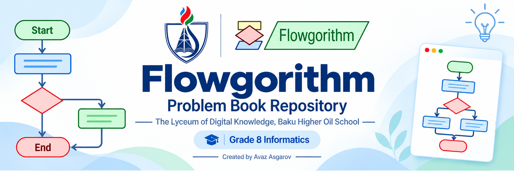

<p align="center">
  
</p>

<p align="center">
  <a href="https://isocpp.org/"></a>
  <a href="https://bhos.edu.az"></a>
  <a href="./LICENSE"></a>
  <a href="./lessons/"></a>
</p>

---

## 📖 Layihə Haqqında

Bu repository məktəblilər, informatika müəllimləri və proqramlaşdırmaya yeni başlayanlar üçün hazırlanmış **açıq C++ tədris və təcrübə vəsaitidir**.

Materiallar Bakı Ali Neft Məktəbinin (BANM) nəzdində fəaliyyət göstərən Rəqəmsal Biliklər Liseyində 8-ci sinif şagirdlərinə tədris olunan mövzular əsasında formalaşdırılmış və açıq mənbəli resurs kimi istifadəyə təqdim edilmişdir.

Məqsəd şagirdlərə proqramlaşdırmanın təməl anlayışlarını — sintaksis, dəyişənlər, giriş/çıxış axınları və alqoritmik düşüncəni — sadə, aydın və praktik nümunələrlə aşılamaqdır.

---

## 📂 Qovluq Strukturu

Repository sadə və rahat naviqasiya üçün aşağıdakı kimi təşkil edilmişdir:

```text
├── assets/                  # Vizual resurslar və banner
├── lessons/                 # Tədris dərsləri və mövzu izahları
│   └── 01-cpp-esaslari/     # Mövzu 01: C++ dilinin əsasları
│       ├── README.md        # Dərsin izahı və təcrübə sualları
│       ├── 01_salam.cpp     # İlk proqram və çıxış
│       ├── 02_...           # Ardıcıl praktik nümunələr
│       └── 08_sade_kalkulyator.cpp
├── homework/                # Çapa hazır ev tapşırığı PDF vərəqləri
│   └── 01-cpp-esaslari.pdf  # 01-ci dərs üçün ev tapşırığı
├── quizzes/                 # Dərsdən dərslə yaddaş yoxlama vərəqləri
│   └── 01-cpp-esaslari-recap.pdf # 10 dəqiqəlik qısa təkrar quiz
├── LICENSE                  # Açıq lisenziya şərtləri (MIT)
└── README.md                # Əsas bələdçi sənəd
```

---

## 🗺️ Tədris Planı (Kurrikulum)

- [x] **Mövzu 01:** [C++ Proqramlaşdırma Dilinin Əsasları](./lessons/01-cpp-esaslari/)
  - *Proqramın quruluşu, `cout`, `cin`, dəyişənlər (`int`, `double`, `string`), hesab əməlləri, tam bölmə və qalıq (`%`)*
- [ ] **Mövzu 02:** Şərt Operatorları (`if`, `else if`, `else`, məntiqi operatorlar)
- [ ] **Mövzu 03:** Dövri Alqoritmlər: `while` və `do-while`
- [ ] **Mövzu 04:** Sayğaclı Dövrlər: `for` dövrü
- [ ] **Mövzu 05:** İç-içə Dövrlər və Naxışlar (Nested Loops)
- [ ] **Mövzu 06:** Birölçülü Massivlər (Arrays)

---

## 💻 Kompilyasiya və İşə Salma Qaydaları

Tədris nümunələri standart C++17 standartına uyğundur və istənilən standart mühitdə rahatlıqla işləyir.

### 1. Terminal / Əmr Sətri (GCC / Clang)
Əmrlər sətrindən istifadə edərək istənilən proqramı birbaşa kompilyasiya edə bilərsiniz:

```bash
# GCC (g++) ilə:
g++ -std=c++17 lessons/01-cpp-esaslari/01_salam.cpp -o proqram
./proqram

# Clang (clang++) ilə:
clang++ -std=c++17 lessons/01-cpp-esaslari/01_salam.cpp -o proqram
./proqram
```

### 2. VS Code və ya Code::Blocks
- **VS Code:** Qovluğu redaktorda açın, `C/C++` əlavəsini quraşdırın və istənilən `.cpp` faylını açıb `Ctrl + F5` ilə icra edin.
- **Code::Blocks:** İstənilən `.cpp` faylını açıb `Build and Run` düyməsinə (`F9`) basmaq kifayətdir.

---

## 👨‍💻 Müəllif Haqqında

Bu materiallar **Əvəz Əsgərov** tərəfindən məktəb tədrisi və açıq təhsil məqsədilə hazırlanmışdır.

- **Fəaliyyət:** Bakı Ali Neft Məktəbinin (BANM) nəzdində Rəqəmsal Biliklər Liseyində İnformatika müəllimi; BANM Proseslərin Avtomatlaşdırılması Mühəndisliyi 5-ci kurs tələbəsi.
- **Əlaqə və Profillər:**
  - [LinkedIn Profili — Əvəz Əsgərov](https://www.linkedin.com/in/avaz-asgarov/)
  - [GitHub Profili — @AvazAsgarov](https://github.com/AvazAsgarov)

---

## 📄 Lisenziya

Bu layihə [MIT Lisenziyası](./LICENSE) altında yayılır. Materiallardan təhsil və tədris məqsədilə sərbəst istifadə etmək mümkündür.
